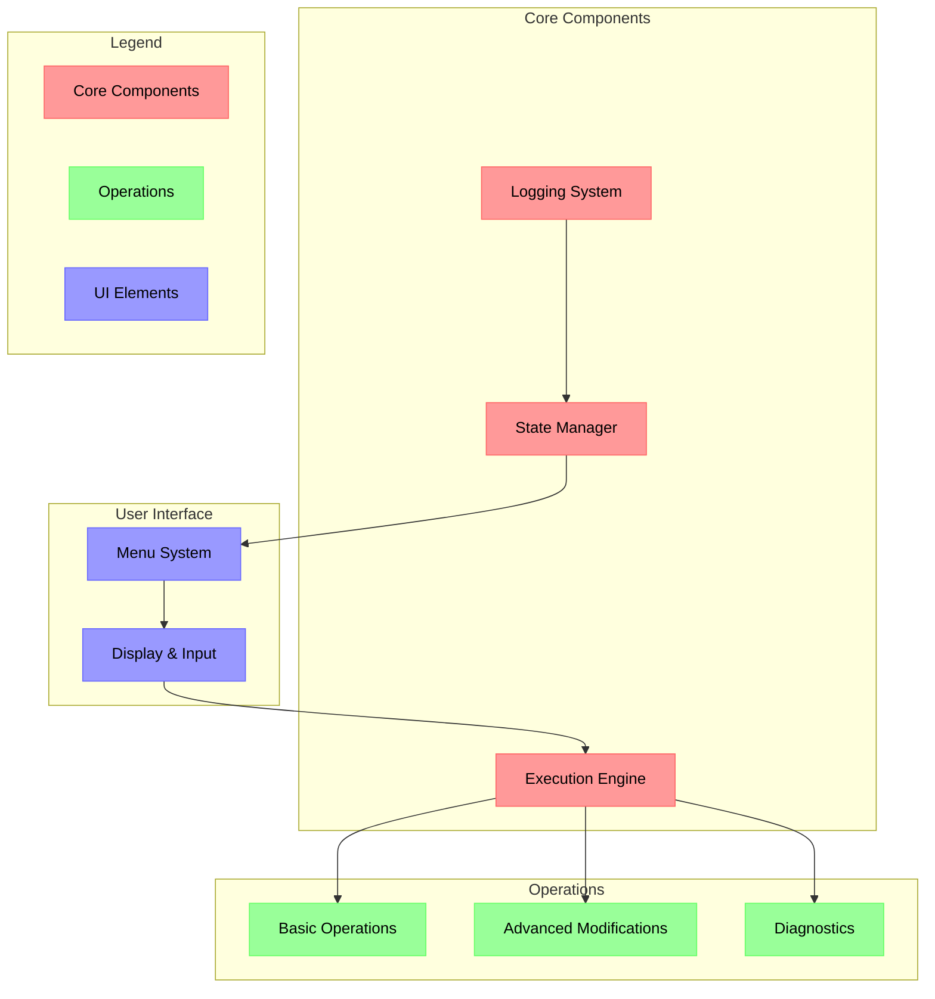

PHREAK v4 is a comprehensive Android operator console that provides a unified interface for various Android device management tasks. This tool combines multiple functionalities into a structured menu-driven system, allowing users to perform everything from basic device operations to advanced modifications.

### Core Architecture

The tool operates through several interconnected layers:

1. **Command Execution Layer**  - Handles ADB and Fastboot operations
  - Manages process execution and error handling
  - Provides logging functionality


2. **Menu System**  - Hierarchical navigation structure
  - Context-aware operation selection
  - Real-time device status display


3. **Operation Categories**  - Basic device management
  - Advanced modification tools
  - Diagnostic utilities
  - Specialized functions (MTK, root, etc.)





The diagram above illustrates the tool's architecture, where:

- Red components represent core system elements that handle fundamental operations
- Green components show operational modules that perform specific device-related tasks
- Blue components indicate user interface elements that manage interaction

Arrows demonstrate data and control flow between components, with the Execution Engine serving as the central coordinator between user interactions and device operations.

### Key Components

#### 1. Command Execution System

```python
def run(cmd, action="exec", shell=False, timeout=None, show_spinner=False, spinner_text=None):
    global LAST
    sp = None
    try:
        if show_spinner:
            sp = Spinner(spinner_text or f"{action}…")
            sp.start()
        # ...
```

This core function handles all external command execution with features including:

- Configurable timeouts
- Spinner-based progress indication
- Comprehensive error handling
- Detailed logging

#### 2. Device Detection

```python
def mode():
    out,_,_ = run(f"{ADB} get-state","detect_adb")
    if out.strip()=="device": return "adb"
    out,_,_ = run(f"{FASTBOOT} devices","detect_fastboot")
    if "fastboot" in out: return "fastboot"
    return None
```

Automatically detects device state and available interfaces:

- ADB mode detection
- Fastboot mode verification
- Connection status reporting

#### 3. Operation Categories

The tool organizes operations into distinct categories:

1. **Basic Operations**  - File transfers (single and batch)
  - Package management
  - System logs viewing
  - Device profiling


2. **Advanced Modifications**  - VBMETA patching
  - Magisk rooting
  - Firmware hunting
  - MTK-specific operations


3. **Diagnostic Tools**  - Device property retrieval
  - Live logcat monitoring
  - Partition backup/restore
  - Driver verification


### Usage Considerations

1. **Prerequisites**  - ADB/Fastboot installation
  - Proper USB drivers
  - Appropriate permissions
  - Required dependencies (avbtool, mtkclient)


2. **Safety Features**  - Timeout protection
  - Error logging
  - Confirmation prompts
  - Backup support


3. **Best Practices**  - Always verify device state before operations
  - Create backups before modifications
  - Monitor logs during critical operations
  - Keep track of last operation status


This implementation provides a robust foundation for Android device management while maintaining flexibility for future enhancements and customizations.
