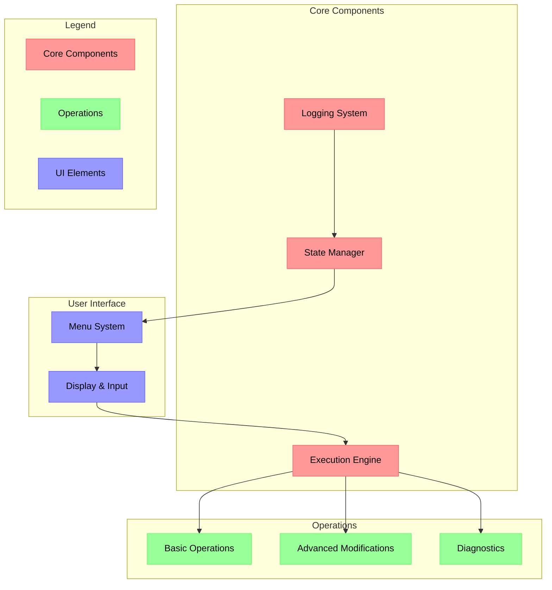

# PHREAK v5

PHREAK v5 is a developer-grade Android operator console. It is a Rich-powered terminal UI that centralises ADB, Fastboot, MTK, and high-risk “hack arsenal” workflows under a single interactive menu. The refreshed release integrates a knowledge base, diagnostic bundle generator, and publish-ready collateral for carrier escalations.

> **Heads-up:** PHREAK v5 is intentionally a terminal application. There is no separate GUI binary—the Rich console exposed by the `phreak_v5` package is the primary interface and exposes every workflow described in the source tree.

## Contents

- [Quickstart](#quickstart)
- [Feature Highlights](#feature-highlights)
- [Knowledge Base & Artifacts](#knowledge-base--artifacts)
- [Architecture Overview](#architecture-overview)
- [Control Tower Blueprint](#control-tower-blueprint)
- [Contributing](#contributing)

## Quickstart

1. **Install prerequisites** – Follow the step-by-step instructions in [`docs/INSTALLATION.md`](docs/INSTALLATION.md). Platform tools (`adb`, `fastboot`) must be on your `PATH`.
2. **Activate your environment** – Optional, but a virtualenv keeps dependencies tidy.
3. **Launch the console** – Connect a device, then run:
   ```bash
   python -m phreak_v5
   ```
4. **Navigate with the keyboard** – Use the numeric shortcuts shown on screen. Press `h` for contextual help, `b` to go back, and `hidden` (or `Ctrl+H` when the `keyboard` package is installed) to surface the hidden operations menu.

Detailed menu walkthroughs live in [`docs/USAGE.md`](docs/USAGE.md).

## Feature Highlights

- **ADB operations** – Shell access, device profiling, smart file push, APK installs, OTA sideload, contact search, USB debugging enablement, and the brand-new diagnostic bundle collector that redacts sensitive identifiers before zipping evidence.
- **Fastboot operations** – Partition flashing/booting, bootloader lock control, automated backups/restores, vbmeta patching, and Magisk auto-root assistance.
- **MTK BootROM tooling** – Guided mediaTek bypass, BROM probing, and partition writes via `mtkclient`.
- **Hack Arsenal** – Wizards for vbmeta patching, BootROM bypass checks, firmware hunting, network unlock triage, and Magisk workflows.
- **Knowledge base** – In-console viewer for cheat sheets, carrier ticket templates, Kotlin telemetry samples, and all installation/usage docs.
- **Hidden menu** – Trigger with `hidden` or `Ctrl+H` to open advanced shell and system-wide fastboot backups.
- **Comprehensive logging** – Every command is journaled to `~/phreak_console.log.jsonl` for auditing.

## Knowledge Base & Artifacts

The `docs/` directory now ships with publish-ready collateral:

| Document | Description |
| -------- | ----------- |
| [`hidden_commands.md`](docs/hidden_commands.md) | Safe Motorola/Android dialer codes and diagnostic ADB/Fastboot probes. |
| [`carrier_ticket_template.md`](docs/carrier_ticket_template.md) | Copy/paste body for provisioning or carrier escalations. |
| [`android_sdk_sample.md`](docs/android_sdk_sample.md) | Kotlin telemetry collector skeleton for embedding in mobile apps. |
| [`INSTALLATION.md`](docs/INSTALLATION.md) | Host setup, dependency installation, and launch instructions. |
| [`USAGE.md`](docs/USAGE.md) | Menu tour, workflow explanations, and diagnostic bundle guidance. |

Access these references directly from the main menu via **Knowledge base library**. They also double as onboarding material for downstream teams.

## Architecture Overview

The Rich-powered console layers command execution, logging, state management, and the menu renderer:


```mermaid
flowchart TD
    classDef core fill:#ff9999,color:#000,stroke:#ff6666
    classDef ops fill:#99ff99,color:#000,stroke:#66ff66
    classDef ui fill:#9999ff,color:#000,stroke:#6666ff

    subgraph Core["Core Components"]
        direction TB
        Exec["Execution Engine"]:::core
        Log["Logging System"]:::core
        State["State Manager"]:::core
    end

    subgraph Ops["Operations"]
        direction TB
        Basic["Basic Operations"]:::ops
        Adv["Advanced Modifications"]:::ops
        Diag["Diagnostics"]:::ops
    end

    subgraph UI["User Interface"]
        direction TB
        Menu["Menu System"]:::ui
        Display["Display & Input"]:::ui
    end

    Exec --> Basic
    Exec --> Adv
    Exec --> Diag

    Log --> State
    State --> Menu

    Menu --> Display
    Display --> Exec

    %% Legend
    subgraph Legend["Legend"]
        C1[Core Components]:::core
        O1[Operations]:::ops
        U1[UI Elements]:::ui
    end
```

### Command Execution

```python
def run(cmd, action="exec", shell=False, timeout=None, show_spinner=False, spinner_text=None):
    # Handles subprocess management, logging, spinner updates, and LAST status banner.
```

- Rich spinners and progress messaging keep long-running operations transparent.
- Logs are appended to `~/phreak_console.log.jsonl` for later auditing.
- Missing binaries and timeouts are surfaced in the UI without crashing the session.

### Device Detection

```python
def mode():
    if adb says "device": return "adb"
    if fastboot reports a device: return "fastboot"
```

- Automatically detects the current transport mode.
- Surfaces quick status in the UI banner.

### Operation Families

- **Basic operations** – Push, install, sideload, profile devices, capture logcat.
- **Advanced modifications** – vbmeta patching, Magisk flows, BootROM utilities.
- **Diagnostics** – Support bundle generator, contact search, network unlock assistant, and firmware hunting.

## Control Tower Blueprint

Looking toward the long-term PHREAK v5 design? The `phreak_v5` Python package converts the blueprint into runnable scaffolding:

- **Core layer (`phreak_v5.core`)** – Connection matrix, policy engine, command router, audit logging, pluggable secret vault.
- **Operator services (`phreak_v5.services`)** – Device graph orchestrator, forensic hub, firmware store, backup scheduler, heuristic diagnostics, and plugin runtime.
- **Presentation surfaces (`phreak_v5.presentation`)** – Stubs for curses control room, web cockpit exporter, automation API façade, and observability collector.
- **Orchestrator (`phreak_v5.PhreakControlTower`)** – High-level façade for registration, job dispatch, secrets, firmware ingestion, backups, and forensics.

This scaffolding is intentionally light on OEM-specific logic so you can grow the platform alongside the console experience.

## Contributing

1. Fork the repo and create a feature branch.
2. Run `python -m phreak_v5` to exercise changes (no GUI build step required).
3. Add tests or documentation as needed.
4. Submit a pull request with a summary of the changes and relevant diagnostics bundles when applicable.

Bugs, feature requests, and pull requests are welcome. When filing tickets, include the support bundle generated by the diagnostic collector to speed up triage.


[url=https://postimg.cc/mP40MxSX][img]https://i.postimg.cc/mP40MxSX/frp.png[/img][/url]

[url=https://postimg.cc/LnLcn4j2][img]https://i.postimg.cc/LnLcn4j2/mdm.png[/img][/url]

