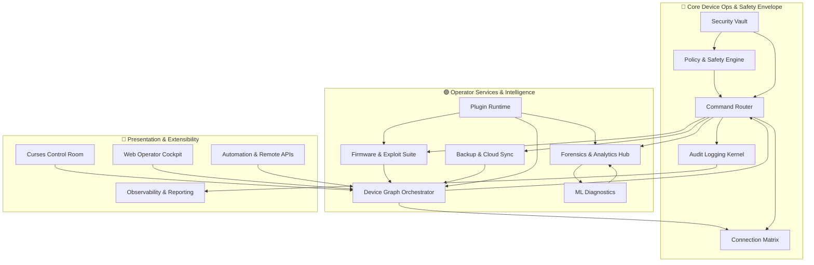

# PHREAK v5 Architecture Blueprint

## Vision

PHREAK v5 evolves the v4 operator console into a full-scale Android control tower that can orchestrate entire device fleets while preserving the safety rails needed for high-risk operations (flashing, rooting, exploit delivery). The platform is split into three color-coded tiers that reflect increasing altitude:

- **🔴 Red — Core Device Operations & Safety Envelope**
- **🟢 Green — Operator Services & Intelligence**
- **🔵 Blue — Presentation & Extensibility**

The stack is service-oriented, with every capability exposed through well-defined contracts so that the curses UI, the web cockpit, automation pipelines, and third-party plugins all speak the same language.

## Layered View

## Red Layer — Core Device Operations & Safety Envelope

| Component | Responsibilities | Implementation Notes |
|-----------|-----------------|-----------------------|
| **Connection Matrix** | Manages simultaneous USB, Wi-Fi ADB, fastboot, emulator, and remote bridges. Maintains health heartbeats and auto-reconnect logic. | Python asyncio service wrapping `adbkit`, `libusb`, and WebSocket tunnels. Exposes gRPC endpoints for session lifecycle (open/close/list). |
| **Policy & Safety Engine** | Evaluates guardrails before allowing destructive actions (battery threshold, RBAC checks, policy DSL). Runs dry-run simulations. | Policy rules expressed as YAML + Rego (OPA) or a custom DSL; evaluated in-process before queuing tasks. |
| **Command Router** | Canonical gateway for all device commands. Normalizes operations into structured jobs with typed inputs/outputs and routes them to the correct transport. | Backed by a task queue (Redis + rq/Celery). Emits lifecycle events on command start/finish/failure. |
| **Audit Logging Kernel** | Tamper-evident append-only logs containing timestamp, operator, device ID, command hash, and results. | Writes to SQLite/PostgreSQL with SHA-256 hash chaining and optional HSM signing. Supports export to JSONL/PDF. |
| **Security Vault** | Secure storage of ADB keys, vendor credentials, and secret payloads. | Uses OS keyring or HashiCorp Vault with envelope encryption. Provides short-lived tokens to upper layers. |

## Green Layer — Operator Services & Intelligence

| Component | Responsibilities | Key Integrations |
|-----------|-----------------|-------------------|
| **Device Graph Orchestrator** | Maintains live topology of all connected devices (physical, emulator, remote). Supports grouping, tagging, and batch dispatch. | Graph stored in Neo4j/Postgres, real-time updates via WebSocket. Batch operations executed through Command Router. |
| **Forensics & Analytics Hub** | Aggregates logcat/system props, snapshots, file hashes, crash dumps. Generates forensic bundles and audit reports. | Leverages Elastic stack/OpenSearch for log indexing. Bundles exported to JSON/PDF with signed manifest. |
| **Firmware & Exploit Suite** | Automates OTA retrieval, verification, flashing, delta patch creation, exploit launchers (Magisk, APatch, KernelSU, CVE loaders). | Uses vendor APIs (Samsung FUS, Pixel OTA feeds), integrates AVB/VBMETA tooling, sandboxed exploit runners with compatibility matrix. |
| **Backup & Cloud Sync Engine** | Handles encrypted backups to S3/GDrive/Azure, remote restore flows, and remote ADB/CLI tunnels. | Uses rclone/libcloud for cloud storage; WebSocket bridge for remote shell. |
| **ML Diagnostics** | Classifies failure scenarios (bootloop, modem crash) from telemetry. Suggests remediation playbooks. | Pipeline built on scikit-learn/PyTorch; models trained on labeled logcat/system data. |
| **Plugin Runtime** | Schema-driven runtime that loads community modules (chipset helpers, exploit packs). | Plugins describe capabilities via JSON schema; validated and sandboxed (importlib + WASM sandbox for risky code). |

## Blue Layer — Presentation & Extensibility

| Surface | Highlights | Notes |
|---------|-----------|-------|
| **Curses Control Room** | TUI console for power operators: device graph view, real-time metrics, fleet commands, policy alerts. | Built with `textual`/`rich`; consumes public gRPC/REST APIs. |
| **Web Operator Cockpit** | Multi-user web dashboard with RBAC-aware controls, interactive logcat viewer, workflow wizards. | React/Next.js frontend, FastAPI backend, WebSocket streams for telemetry. |
| **Automation & Remote APIs** | REST/gRPC/WebSocket interfaces for CI/CD integration, scripting, and remote ADB proxy. | Token-based auth with scopes; integrates with Vault for short-lived credentials. |
| **Observability & Reporting** | Scheduled reports, incident timelines, notifications (Slack/Email/Webhooks), metrics export (Prometheus). | Pulls from Audit Logging Kernel and Device Graph; Grafana dashboards for fleet health. |

## Cross-Cutting Concerns

- **RBAC & Operator Roles:** Users assigned to observer/tester/root-operator roles. Sensitive actions require step-up auth (TOTP/U2F) and policy approval.
- **Safety Playbooks:** Every destructive workflow has a dry-run, pre-flight checks, and contextual warnings (battery < 40%, bootloader locked, etc.).
- **Telemetry Bus:** Kafka/NATS captures device events, command lifecycle updates, and ML insights for dashboards and automation hooks.
- **Configuration Management:** Declarative manifests per lab/tenant describing device pools, policy defaults, and cloud storage destinations.
- **Testing Matrix:** Continuous integration harness spins up emulator farm to regression-test plugins and command pipelines.

## Typical Flows

### 1. Fleet Flashing Workflow
1. Operator selects device cohort in the web cockpit.
2. UI calls Device Graph Orchestrator to create a batch job.
3. Policy Engine validates guardrails (battery, policy tags, RBAC).
4. Command Router fans out `flash` tasks to target devices via Connection Matrix.
5. Firmware Suite verifies OTA images, signs commands, and streams progress.
6. Audit Logging Kernel chains records, Observability service pushes notifications.

### 2. Forensic Collection
1. Incident responder triggers "Forensic Snapshot" plugin for a device.
2. Plugin Runtime loads module, defines required artifacts (logcat dump, `/proc` snapshots, key files).
3. Command Router executes read-only pulls; data funneled to Forensics Hub.
4. Forensics Hub packages artifacts, generates signed manifest, and exports to analyst via S3 link.

### 3. ML-Assisted Diagnostics
1. Telemetry bus streams crash logs to ML Diagnostics service.
2. Model predicts "modem crash" with confidence score.
3. Recommendation engine suggests re-flashing radio + clearing modem NV data.
4. Operator receives alert in Curses/Web UI with one-click remediation playbook.

## Deployment Topology

- **Control Plane:** Containerized microservices (FastAPI, Celery workers, PostgreSQL, Redis, Vault) deployed via Docker Compose or Kubernetes.
- **Edge Agents:** Lightweight Python daemon per workstation or lab controller that hosts Connection Matrix and proxies commands to attached devices.
- **Plugin Registry:** Signed plugin bundles stored in OCI registry; runtime verifies signature and compatibility manifest before loading.
- **Remote Access:** Optional reverse proxy (Traefik/Caddy) for WAN access with mTLS; remote operators connect through RBAC-aware web cockpit.

## Extensibility Roadmap

1. **SDKs:** Python/Go SDKs for automation; TypeScript client for web integrations.
2. **Marketplace:** Curated directory of community plugins with rating/verification metadata.
3. **Workflow Builder:** Visual designer for chaining commands/policies (e.g., "Unlock ➜ Flash ➜ Verify ➜ Report").
4. **Analytics Packs:** Pre-built ML models for specific OEMs, distributed as versioned plugin bundles.
5. **Hardware Integrations:** Rack power controllers, USB switchers, and robotic automation for large device labs.

This blueprint provides the structural foundation needed to implement PHREAK v5 incrementally while keeping the system modular, auditable, and operator-friendly.
